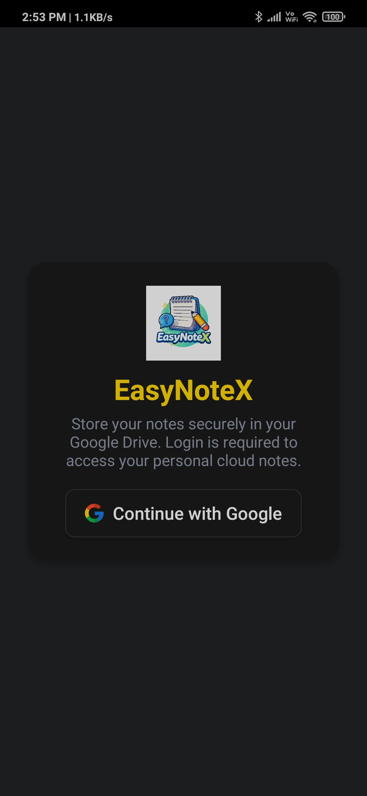
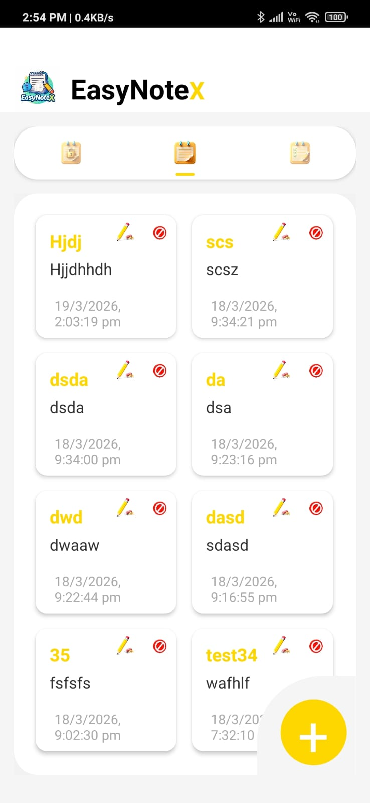
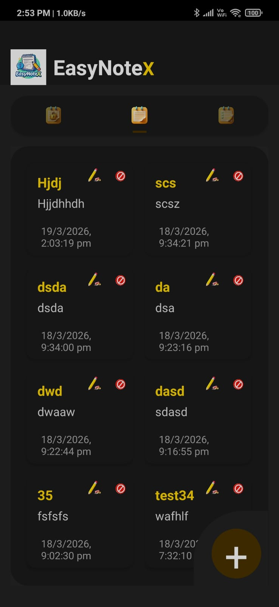
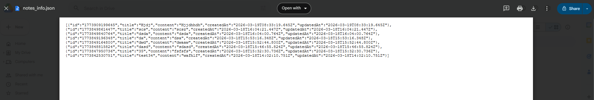

# 📝 EasyNoteX

EasyNoteX is a modern note-taking application that stores your notes securely in **Google Drive**. It provides a clean UI, smooth performance, and cloud-based access to your personal notes anytime, anywhere.

---

## 🚀 Features

* ✍️ Create, edit, and delete notes
* ☁️ Cloud storage using Google Drive
* 🔐 Secure login with Google Authentication
* 🌓 Dark & Light mode UI
* 📱 Clean and responsive mobile design
* 🗂️ Notes stored in JSON format
* ⚡ Fast and lightweight

---

## 📸 Screenshots

## 📸 Screenshots

### 🔐 Login Screen
<p align="center">
  
</p>

### 📝 Notes Dashboard (Light Mode)
<p align="center">
  
</p>

### 🌙 Notes Dashboard (Dark Mode)
<p align="center">
  
</p>

### ➕ Add Note Screen
<p align="center">
  
</p>

### ☁️ Stored JSON File in Google Drive
<p align="center">
  
</p>

---

## 🛠️ Tech Stack

* **Frontend:** HTML, CSS, JavaScript
* **Framework:** (Android WebView / Electron / Hybrid App)
* **Cloud:** Google Drive API
* **Auth:** Google Sign-In

---

## 📂 Data Format

```json
[
  {
    "id": "1773909199645",
    "title": "Sample Note",
    "content": "This is a note",
    "createdAt": "2026-03-19T08:33:19.645Z",
    "updatedAt": "2026-03-19T08:33:19.645Z"
  }
]
```

---

## ⚙️ Setup Instructions

1. Clone the repository

```bash
https://github.com/SohanPendhari/Notes-app.git
```

2. Open project folder

```bash
cd Notes-app
```

3. Configure Google API:

* Go to Google Cloud Console
* Enable **Google Drive API**
* Create OAuth credentials
* Add your Client ID in project

4. Run the app

---

## 🔑 Permissions Required

* Google Drive access (to store notes)
* Internet connection

---

## 📌 Future Improvements

* 🔍 Search notes
* 🏷️ Categories / Tags
* 🗃️ Offline mode
* 🔔 Reminders
* 📤 Export notes

---

## 👨‍💻 Author

**Sohan Pendhari**

---

## ⭐ Support

If you like this project, give it a ⭐ on GitHub!
